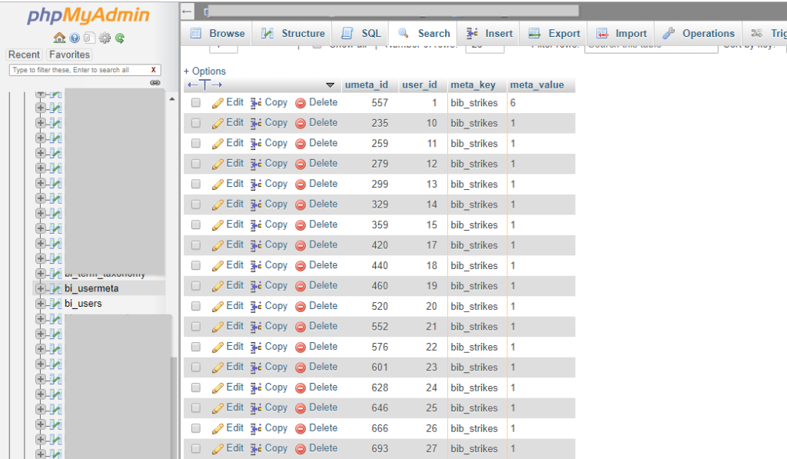
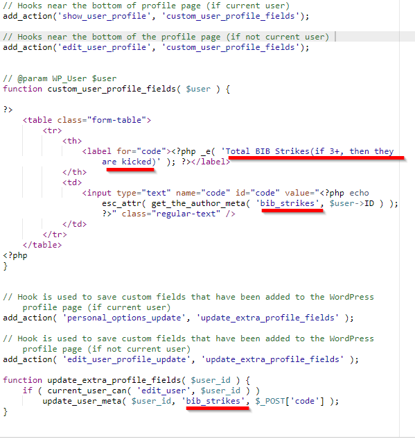

For my WordPress users, I add a lot of custom wp_usermeta attributes. 

Within the WordPress Database, there are two tables for user-specific data. They are the wp\_users (which contains information like the student&#8217;s email, name, password, etc), and the wp\_usermeta (which contains everything else). For more information about the way WordPress sets up their tables, [check out the documentation.][1] 

You can store custom data in the wp_usermeta. 

## Example:

To explain how I built it in my courses &#8212; In the Business Ignition Bootcamp course, students can get &#8216;STRIKES&#8217; if they fail to submit their homework on time. I can store how many strikes a user has in the wp_usermeta. 

  * When students create their account, I set up a usermeta called &#8216;bib_strikes&#8217; into their usermeta. 
  * Students have to submit their homework via GravityForms before a specific due date.
  * On that specific due date, I have CRON job that runs another piece of code that checks to see if they submitted the homework or not.
  * If they did NOT submit it, it runs another piece of code that adds a +1 to the &#8216;bib_strikes&#8217; for that student, storing that data.
  * On the front end, the website displays how many strikes the user has. If they failed to submit, they now have 1 strike, based on that &#8216;bib_strikes&#8217; data.

## Other Use Cases:

  1. You can store if a user completed a tutorial in the wp_usermeta.
  2. You can track their student progress and store it here as well.
  3. You can notate if the student has clicked on a specific button, set a certain option, or even flag them that they reached out to support.

The options are endless.

## But what about changing things?

It&#8217;s easy to update data by using the [update\_user\_meta().][2]

But let&#8217;s say my code gave a student a strike, and the student apologizes and wants it removed.

There&#8217;s two ways to change that value: 

**METHOD 1:** 

You can change it through the WordPress database itself. Visit myPHPAdmin, that opens up the WordPress mySQL database in a web format. 

You then navigate to the wp\_usermeta table, find the user, find the meta\_value, and modify.

<!--  -->
<figcaption>Notice that user ID 1 has 6 strikes. User ID 1 is often an admin, btw. </figcaption>

The challenge with this method is that if you have support who aren&#8217;t familiar with this, they can really break things. (And do you really want to give a non-developer access to something that can ruin your entire site?)

**METHOD 2: (Better way)**

The better way is to add this snippet of code to a plugin or functions.php. 

For your use &#8211; change the following:
<!--  -->

 [1]: https://codex.wordpress.org/Database_Description
 [2]: https://codex.wordpress.org/Function_Reference/update_user_meta